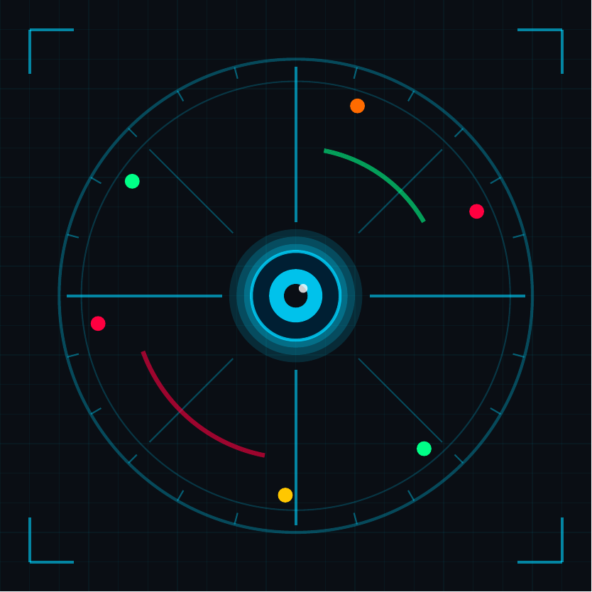
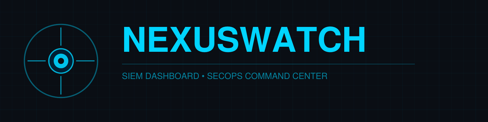
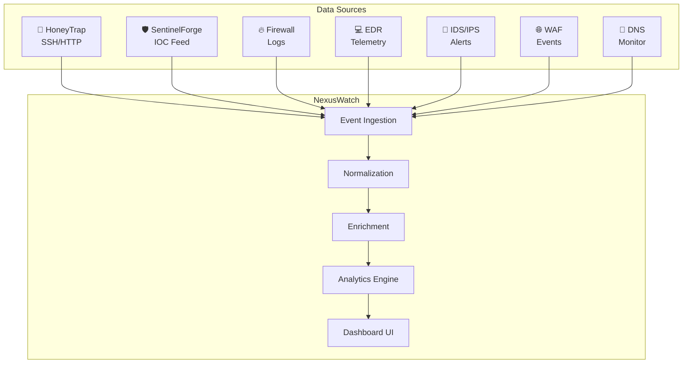
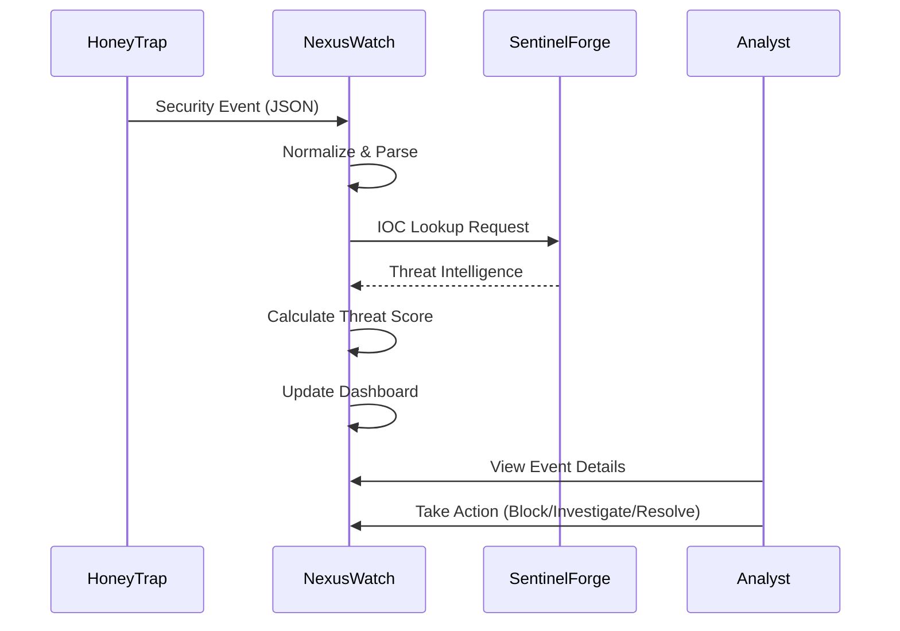

<p align="center">
  
</p>

<p align="center">
  
</p>

<p align="center">
  <h1 align="center">👁️ NEXUSWATCH</h1>
  <p align="center">
    <em>See Everything. Miss Nothing. Respond Faster.</em>
  </p>
</p>

<p align="center">
  
  
  
</p>

<p align="center">
  <em>Built with the tools and technologies:</em>
</p>

<p align="center">
  
  
  
  
  
  
</p>

---

## 📖 Overview

NexusWatch is the SIEM Dashboard component of the SecOps Command Center - a centralized security event monitoring platform that aggregates, correlates, and visualizes security events from across your infrastructure. It integrates with HoneyTrap (honeypot network) and SentinelForge (threat intelligence) to provide real-time security visibility.

## ✨ Features

- **Real-Time Event Stream** - Live security events with 3-second auto-refresh
- **Severity Filtering** - Filter by Critical, High, Medium, Low
- **IOC Matching** - Automatic correlation with SentinelForge threat intel
- **Threat Scoring** - Dynamic risk scoring per event (0-100)
- **24h Timeline** - Hourly event distribution visualization
- **Attack Origins** - Top source IP analysis
- **Data Source Health** - Monitor all 8 integrated sources
- **Event Investigation** - Click-through details with Block/Investigate/Resolve actions

## 🏗️ Architecture



## 📊 Event Flow



## 🛠️ Tech Stack

| Component | Technology | Purpose |
|-----------|------------|---------|
| Frontend | React 18 | Dashboard UI |
| Build Tool | Vite 5 | Fast development & bundling |
| Styling | Inline CSS + CSS Variables | Cyberpunk aesthetic |
| Fonts | Orbitron, JetBrains Mono | Terminal/tech feel |
| Integration | Python | Bridge script for HoneyTrap/SentinelForge |
| Logo | ReportLab | PDF vector graphics |

## 📁 Project Structure

```
nexuswatch/
├── src/
│   ├── App.jsx              # Main dashboard component
│   └── main.jsx             # React entry point
├── public/
│   ├── nexuswatch-logo.pdf  # Square logo
│   └── nexuswatch-banner.pdf # Wide banner
├── scripts/
│   ├── generate_logo.py     # Logo generator
│   └── integration_bridge.py # HoneyTrap/SentinelForge connector
├── index.html               # HTML template
├── package.json             # Dependencies
├── vite.config.js           # Vite configuration
└── README.md
```

## 🚀 Quick Start

### Prerequisites

- Node.js 18+
- npm or yarn

### Installation

```bash
# Clone the repository
git clone https://github.com/yourusername/nexuswatch.git
cd nexuswatch

# Install dependencies
npm install

# Start development server
npm run dev
```

Dashboard available at `http://localhost:3000`

### Production Build

```bash
npm run build
npm run preview
```

## 🐳 Docker Deployment

```dockerfile
FROM node:18-alpine AS builder
WORKDIR /app
COPY package*.json ./
RUN npm ci
COPY . .
RUN npm run build

FROM nginx:alpine
COPY --from=builder /app/dist /usr/share/nginx/html
EXPOSE 80
CMD ["nginx", "-g", "daemon off;"]
```

```bash
docker build -t nexuswatch:latest .
docker run -d -p 3000:80 nexuswatch:latest
```

## 🔌 Integration Bridge

Connect HoneyTrap and SentinelForge to NexusWatch:

```bash
python scripts/integration_bridge.py \
  --honeytrap-dir ./honeytrap/events \
  --sentinelforge http://localhost:3001 \
  --nexuswatch http://localhost:3000 \
  --interval 5
```

### Event Format

```json
{
  "id": "EVT-000001",
  "timestamp": "2026-01-22T10:30:00Z",
  "type": "BRUTE_FORCE",
  "severity": "high",
  "source": "HoneyTrap-SSH",
  "sourceIp": "185.220.101.45",
  "destIp": "10.0.1.50",
  "destPort": 22,
  "status": "active",
  "details": "Multiple failed SSH authentication attempts",
  "iocMatch": true,
  "threatScore": 85
}
```

## ⌨️ Keyboard Shortcuts

| Key | Action |
|-----|--------|
| `Ctrl+L` | Toggle live mode on/off |
| `Escape` | Close event detail modal |

## 📈 Metrics Displayed

| Metric | Description |
|--------|-------------|
| Total Events (24h) | Aggregate event count with hourly trend |
| Critical Alerts | High-priority incidents requiring attention |
| Active Threats | Currently unresolved security threats |
| Blocked IPs | IPs blocked by automated response |
| IOC Matches | Events matching known threat indicators |
| Events/sec | Real-time ingestion throughput |
| Avg Response | Mean incident response time |
| Data Sources | Number of active data feeds |

## 🔒 Security Considerations

- Deploy behind reverse proxy with TLS
- Enable authentication for production
- Restrict access to internal security team
- Do not expose to public internet
- Audit dashboard access regularly

## 🗺️ SecOps Command Center Roadmap

| # | Component | Status | Description |
|---|-----------|--------|-------------|
| 1 | HoneyTrap | ✅ Complete | Distributed honeypot network |
| 2 | SentinelForge | ✅ Complete | Threat intelligence aggregator |
| 3 | **NexusWatch** | ✅ Complete | SIEM Dashboard |
| 4 | IronFlow | ✅ Complete | Incident Response Orchestrator |
| 5 | Compliance Engine | 🔜 Planned | Regulatory adherence tracking |

## 🤝 Contributing

1. Fork the repository
2. Create your feature branch (`git checkout -b feature/amazing-feature`)
3. Commit your changes (`git commit -m 'Add amazing feature'`)
4. Push to the branch (`git push origin feature/amazing-feature`)
5. Open a Pull Request

## 📄 License

This project is licensed under the MIT License - see the [LICENSE](LICENSE) file for details.

## 🙏 Acknowledgments

- [React](https://reactjs.org/) - UI framework
- [Vite](https://vitejs.dev/) - Build tooling
- [JetBrains Mono](https://www.jetbrains.com/lp/mono/) - Monospace font
- [Orbitron](https://fonts.google.com/specimen/Orbitron) - Display font

---

<p align="center">
  <strong>Part of the SecOps Command Center</strong><br>
  🍯 HoneyTrap • 🛡️ SentinelForge • 👁️ NexusWatch • ⚡ IronFlow
</p>
